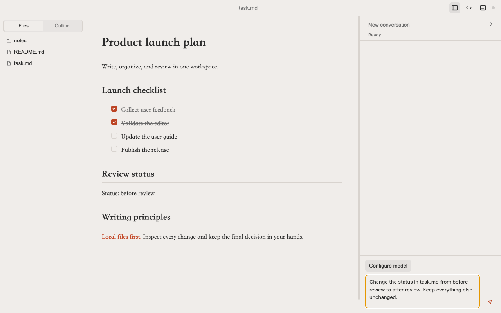
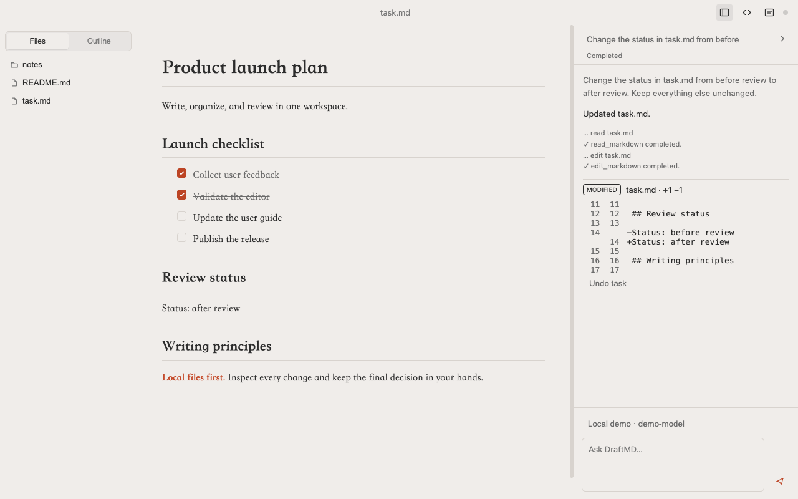

# DraftMD

> The open-source macOS AI Markdown editor.

The source includes Windows x64 candidate adaptation. Windows runtime acceptance
is still required; release downloads remain macOS-only.
See [Windows build and testing](docs/windows.md).

**Language / 语言: [English](README.md) · [中文](README_CN.md)**

DraftMD combines a visual Markdown editor with an AI agent that works inside a folder you choose. Configure a model service, ask it to read or update your documents, inspect the changes, and undo a task when needed. External file changes also appear in real time while unsaved local edits are protected.

[](https://opensource.org/licenses/MIT)

## See It in Action

### 1. Open a folder and start writing

The file list opens automatically on the left. Edit Markdown in the center and keep the Agent beside your document on the right.



### 2. Ask for a change, then review it

Configure a model service in **Model Settings** and run its capability test. Send a request such as “Change the review status in task.md and keep everything else unchanged.” Expand a changed file to inspect the Diff; **Undo task** reverts that task while checking for conflicts with later edits. Deleting a document requires approval.



*Actual DraftMD UI captured with sample documents and a deterministic local demo provider. These screenshots illustrate the workflow, not the output quality or compatibility of a particular cloud model. No private documents or API keys are used.*

## Features

- **Built-in Agent & Chat**: Stream replies, follow tool activity, approve file deletion, and stop a running task. Providers are tested and labeled Agent, Chat only, or Unavailable.
- **Reviewable Changes**: Inspect per-task file changes and Diff, undo with conflict checks, and recover interrupted tasks.
- **Local Conversations**: Workspace-scoped history and context, with secrets in the OS credential store (macOS Keychain / Windows Credential Manager).
- **Live Agent Sync** — External changes appear in the editor in real time.
- **True WYSIWYG Editing** — Edit Markdown as rich text without a split preview.
- **Files & Outline**: Open a folder as a workspace, browse its Markdown files, or navigate document headings.
- **Source Mode** — Switch to raw Markdown whenever precise source editing is useful.
- **Markdown Essentials** — Task lists, highlights, KaTeX formulas, Mermaid diagrams, search, and smart line breaks.
- **Built-in Themes** — Choose from twelve bundled light and dark themes.
- **PDF & HTML Export** — Export the current document with its active presentation.
- **Universal macOS App**: Packages target Apple silicon and Intel on macOS 13 or later. Physical Intel and macOS 13 runtime validation remain release checks.
- **Minimal by Design** — No permanent toolbar or status bar.

## Getting Started

1. Install the [latest release](https://github.com/zhnpeng/DraftMD/releases/latest). Read the [0.1.1 installation notes](docs/releases/v0.1.1.md) for its unsigned-build limitations.
2. Open a folder containing your Markdown documents.
3. Configure a provider and run its capability test. See [provider compatibility](docs/provider-compatibility.md).
4. Start a conversation in the Agent Dock. Agent-capable configurations can use workspace file tools; Chat only configurations provide text suggestions.
5. Review changes and any deletion approval, then keep the result or use Undo.

This README describes the current source tree. The [0.1.1 release notes](docs/releases/v0.1.1.md) describe the release, and the [roadmap](docs/roadmap.md) lists outstanding validation. See [privacy](docs/privacy.md) for local storage, snapshot retention, and what is sent to providers.

## Development

Requirements: Node.js 22.12 or later and macOS or Windows x64 (candidate adaptation).
Use `npm run dist:win` for Windows packages; see [Windows testing scope](docs/windows.md).

```bash
npm install
npm run dev
```

Quality gates:

```bash
npm run test
npm run typecheck
npm run test:integration
npm run test:security
npm run test:e2e
npm run test:performance
npm run build
npm run check:theme-colors
```

Build the Universal macOS distributables:

```bash
npm run dist:mac
```

GitHub Releases and local builds are currently unsigned and not notarized. The optional `npm run dist:mac:signed` command requires Apple Developer ID and notarization credentials; signing is independent of GitHub release status.

## Documentation

- [Current status and roadmap](docs/roadmap.md)
- [Feature candidates and deferred scope](docs/feature-requests.md)
- [Release checklist](docs/release-checklist.md)
- [Privacy](docs/privacy.md)
- [Provider compatibility](docs/provider-compatibility.md)
- [Contributing](CONTRIBUTING.md)
- [Security policy](SECURITY.md)
- [Notices and attribution](NOTICE.md)

## Project origin

DraftMD is a modified derivative of [ColaMD](https://github.com/marswaveai/ColaMD), originally developed by marswave.ai and released under the MIT License. DraftMD preserves the upstream copyright and license notice. See [NOTICE.md](NOTICE.md) for provenance and bundled third-party notices.

## License

[MIT](LICENSE). Copyright and attribution details are preserved in the license and notice files.
