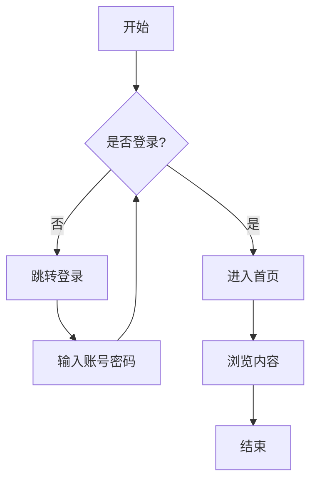
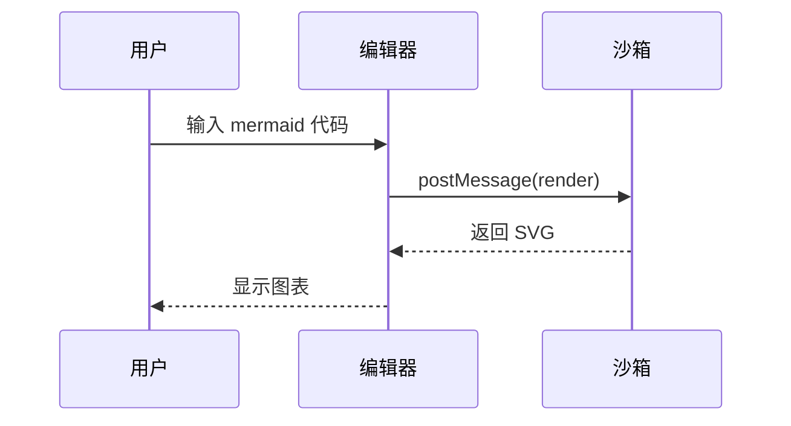
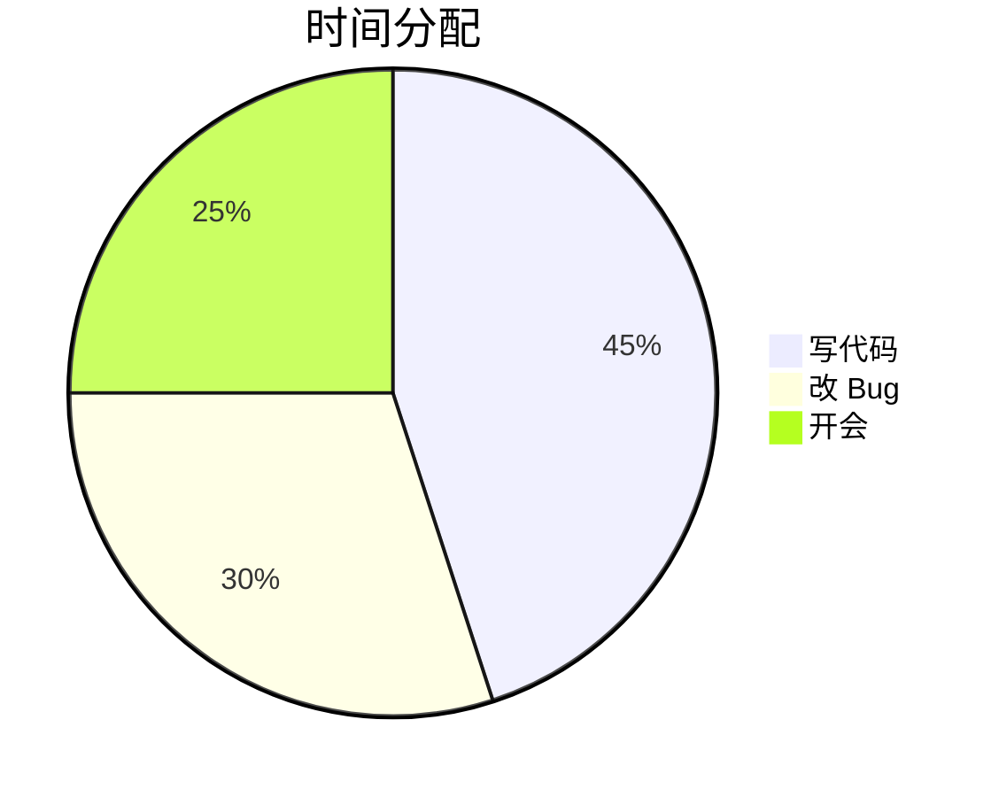
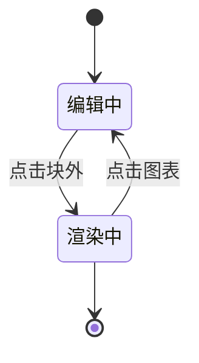

# Mermaid 渲染测试

> 用于验证 Mermaid 沙箱渲染：正常图、错误图、普通代码块、大图。

## 1. 流程图（应正常渲染）



## 2. 时序图（应正常渲染）



## 3. 饼图（应正常渲染）



## 4. 语法错误（应显示源码 + 错误条）

```mermaid
flowchart TD
    A[开始 --> 这里有语法错误
```

## 5. 普通代码块（应保持原生可编辑，不渲染）

```js
function hello(name) {
  console.log(`Hello, ${name}!`)
}
hello('ColaMD')
```

## 6. 编辑测试

点击下方图表应回到源码编辑；点击文档其他位置后应重新渲染：



## 7. 大图（~200 节点，渲染期间输入应不卡顿）

```mermaid
flowchart TD
    N0[节点 0] --> N1
    N1[节点 1] --> N2
    N2[节点 2] --> N3
    N3[节点 3] --> N4
    N4[节点 4] --> N5
    N5[节点 5] --> N6
    N6[节点 6] --> N7
    N7[节点 7] --> N8
    N8[节点 8] --> N9
    N9[节点 9] --> N10
    N10[节点 10] --> N11
    N10[节点 10] --> N0
    N11[节点 11] --> N12
    N12[节点 12] --> N13
    N13[节点 13] --> N14
    N14[节点 14] --> N15
    N15[节点 15] --> N16
    N16[节点 16] --> N17
    N17[节点 17] --> N18
    N18[节点 18] --> N19
    N19[节点 19] --> N20
    N20[节点 20] --> N21
    N20[节点 20] --> N10
    N21[节点 21] --> N22
    N22[节点 22] --> N23
    N23[节点 23] --> N24
    N24[节点 24] --> N25
    N25[节点 25] --> N26
    N26[节点 26] --> N27
    N27[节点 27] --> N28
    N28[节点 28] --> N29
    N29[节点 29] --> N30
    N30[节点 30] --> N31
    N30[节点 30] --> N20
    N31[节点 31] --> N32
    N32[节点 32] --> N33
    N33[节点 33] --> N34
    N34[节点 34] --> N35
    N35[节点 35] --> N36
    N36[节点 36] --> N37
    N37[节点 37] --> N38
    N38[节点 38] --> N39
    N39[节点 39] --> N40
    N40[节点 40] --> N41
    N40[节点 40] --> N30
    N41[节点 41] --> N42
    N42[节点 42] --> N43
    N43[节点 43] --> N44
    N44[节点 44] --> N45
    N45[节点 45] --> N46
    N46[节点 46] --> N47
    N47[节点 47] --> N48
    N48[节点 48] --> N49
    N49[节点 49] --> N50
    N50[节点 50] --> N51
    N50[节点 50] --> N40
    N51[节点 51] --> N52
    N52[节点 52] --> N53
    N53[节点 53] --> N54
    N54[节点 54] --> N55
    N55[节点 55] --> N56
    N56[节点 56] --> N57
    N57[节点 57] --> N58
    N58[节点 58] --> N59
    N59[节点 59] --> N60
    N60[节点 60] --> N61
    N60[节点 60] --> N50
    N61[节点 61] --> N62
    N62[节点 62] --> N63
    N63[节点 63] --> N64
    N64[节点 64] --> N65
    N65[节点 65] --> N66
    N66[节点 66] --> N67
    N67[节点 67] --> N68
    N68[节点 68] --> N69
    N69[节点 69] --> N70
    N70[节点 70] --> N71
    N70[节点 70] --> N60
    N71[节点 71] --> N72
    N72[节点 72] --> N73
    N73[节点 73] --> N74
    N74[节点 74] --> N75
    N75[节点 75] --> N76
    N76[节点 76] --> N77
    N77[节点 77] --> N78
    N78[节点 78] --> N79
    N79[节点 79] --> N80
    N80[节点 80] --> N81
    N80[节点 80] --> N70
    N81[节点 81] --> N82
    N82[节点 82] --> N83
    N83[节点 83] --> N84
    N84[节点 84] --> N85
    N85[节点 85] --> N86
    N86[节点 86] --> N87
    N87[节点 87] --> N88
    N88[节点 88] --> N89
    N89[节点 89] --> N90
    N90[节点 90] --> N91
    N90[节点 90] --> N80
    N91[节点 91] --> N92
    N92[节点 92] --> N93
    N93[节点 93] --> N94
    N94[节点 94] --> N95
    N95[节点 95] --> N96
    N96[节点 96] --> N97
    N97[节点 97] --> N98
    N98[节点 98] --> N99
    N99[节点 99] --> N100
    N100[节点 100] --> N101
    N100[节点 100] --> N90
    N101[节点 101] --> N102
    N102[节点 102] --> N103
    N103[节点 103] --> N104
    N104[节点 104] --> N105
    N105[节点 105] --> N106
    N106[节点 106] --> N107
    N107[节点 107] --> N108
    N108[节点 108] --> N109
    N109[节点 109] --> N110
    N110[节点 110] --> N111
    N110[节点 110] --> N100
    N111[节点 111] --> N112
    N112[节点 112] --> N113
    N113[节点 113] --> N114
    N114[节点 114] --> N115
    N115[节点 115] --> N116
    N116[节点 116] --> N117
    N117[节点 117] --> N118
    N118[节点 118] --> N119
    N119[节点 119] --> N120
    N120[节点 120] --> N121
    N120[节点 120] --> N110
    N121[节点 121] --> N122
    N122[节点 122] --> N123
    N123[节点 123] --> N124
    N124[节点 124] --> N125
    N125[节点 125] --> N126
    N126[节点 126] --> N127
    N127[节点 127] --> N128
    N128[节点 128] --> N129
    N129[节点 129] --> N130
    N130[节点 130] --> N131
    N130[节点 130] --> N120
    N131[节点 131] --> N132
    N132[节点 132] --> N133
    N133[节点 133] --> N134
    N134[节点 134] --> N135
    N135[节点 135] --> N136
    N136[节点 136] --> N137
    N137[节点 137] --> N138
    N138[节点 138] --> N139
    N139[节点 139] --> N140
    N140[节点 140] --> N141
    N140[节点 140] --> N130
    N141[节点 141] --> N142
    N142[节点 142] --> N143
    N143[节点 143] --> N144
    N144[节点 144] --> N145
    N145[节点 145] --> N146
    N146[节点 146] --> N147
    N147[节点 147] --> N148
    N148[节点 148] --> N149
    N149[节点 149] --> N150
    N150[节点 150] --> N151
    N150[节点 150] --> N140
    N151[节点 151] --> N152
    N152[节点 152] --> N153
    N153[节点 153] --> N154
    N154[节点 154] --> N155
    N155[节点 155] --> N156
    N156[节点 156] --> N157
    N157[节点 157] --> N158
    N158[节点 158] --> N159
    N159[节点 159] --> N160
    N160[节点 160] --> N161
    N160[节点 160] --> N150
    N161[节点 161] --> N162
    N162[节点 162] --> N163
    N163[节点 163] --> N164
    N164[节点 164] --> N165
    N165[节点 165] --> N166
    N166[节点 166] --> N167
    N167[节点 167] --> N168
    N168[节点 168] --> N169
    N169[节点 169] --> N170
    N170[节点 170] --> N171
    N170[节点 170] --> N160
    N171[节点 171] --> N172
    N172[节点 172] --> N173
    N173[节点 173] --> N174
    N174[节点 174] --> N175
    N175[节点 175] --> N176
    N176[节点 176] --> N177
    N177[节点 177] --> N178
    N178[节点 178] --> N179
    N179[节点 179] --> N180
    N180[节点 180] --> N181
    N180[节点 180] --> N170
    N181[节点 181] --> N182
    N182[节点 182] --> N183
    N183[节点 183] --> N184
    N184[节点 184] --> N185
    N185[节点 185] --> N186
    N186[节点 186] --> N187
    N187[节点 187] --> N188
    N188[节点 188] --> N189
    N189[节点 189] --> N190
    N190[节点 190] --> N191
    N190[节点 190] --> N180
    N191[节点 191] --> N192
    N192[节点 192] --> N193
    N193[节点 193] --> N194
    N194[节点 194] --> N195
    N195[节点 195] --> N196
    N196[节点 196] --> N197
    N197[节点 197] --> N198
    N198[节点 198] --> N199
    N199[节点 199] --> N200
```

